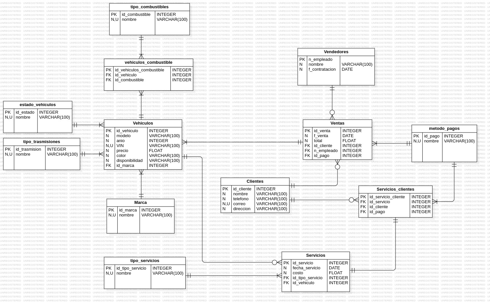

# Concesionario 🚗
Base de datos concesionario de vehículos para gestionar la información sobre los vehículos en stock, clientes, ventas, y servicios de mantenimiento. 
## Contenido 
1. [Información general](#info-general)
2. [Tecnologías](#tecno)
3. [Instalación y ejecución](#install)
4. [Autores](#autores)

---
<a name="info-general"></a>
## Información general :speech_balloon:

- **Estado**: completado :white_check_mark:
  
### Diagrama UML E - R

  

### Justificación de diseño 

El diseño de la base de datos se estructuró para gestionar la información relacionada con vehículos, sus estados, tipos de combustible, marcas, servicios y ventas.

**Tablas**:
   - **estado_vehiculos**: tabla para categorizar los estados de un vehículo (nuevo, usado). 
   - **tipo_trasmisiones**: tabla para categorizar el tipo de trasmisión que tiene un vehículo. 
   - **tipo_combustibles**: tabla para categorizar el tipo de combustible que usa un vehículo. 
   - **Marcas**: tabla que guarda las marcas de los vehículos. 
   - **Vehículos**: tabla que guarda la información de cada vehículo. 
   - **vehiculos_combustible**: tabla para manejar la relación de muchos a muchos entre vehículos y tipos de combustibles. 
   - **Clientes**: tabla para guardar los datos de los clientes. 
   - **Vendedores**: tabla para guardar los datos de los vendedores. 
   - **tipo_servicios**: tabla para guardar los tipos de servicios (mantenimiento preventivo, correctivo, etc.) que ofrece el concesionario. 
   - **Servicios**: tabla para gestionar los servicios realizados a los vehículos. 
   - **metodo_pagos**: tabla para gestionar los metodos de pagos que existen. 
   - **servicios_clientes**: tabla para guardar los servicios cuando se hacen a un vehículo que ya esta vendido (es decir, le pertenece a un cliente). 
   - **ventas**: tabla para guardar las ventas realizadas. 

**Relaciones**:
   - Las relaciones entre las tablas se establecieron mediante claves foráneas. Por ejemplo, un vehículo está relacionado con su marca a través de la clave foránea `id_marca` en la tabla `Vehiculos`. 

### Restricciones y validaciones

- **Claves primarias**: cada tabla tiene una clave primaria que asegura la unicidad de cada registro. Por ejemplo:
   - `id_estado` en `estado_vehiculos`
   - `id_vehiculo` en `Vehiculos`

- **Claves foráneas**: las claves foráneas garantizan que las relaciones entre tablas sean coherentes. Por ejemplo:
   - `id_marca` en `Vehiculos` hace referencia a `Marcas(id_marca)`.
   - `id_cliente` en `Ventas` hace referencia a `Clientes(id_cliente)`.

- **Restricciones de unicidad**: se aplicaron a campos que deben ser únicos por ejemplo en el `correo` en `Clientes` y el `VIM` en `Vehiculos`, evitando duplicados en la base de datos.
- **Restricciones de valores no nulos**: se aplicaron
  
### Relaciones UML
---
<a name="tecno"></a>
## Tecnologías :computer:

- **Visual Studio Code**
- **StarUML**

---
<a name="install"></a>
## Instalación y ejecución :wrench:

### Requisitos 
- Git. 
- Visual Studio Code
  
### Paso a paso 
1. Entra a la carpeta donde deseas clonar el repositorio.
2. Abre el terminal y copia el siguiente código: <br><br>
   ```
   git clone https://github.com/laura2ndrea/Concesionario.git 
   ```
3. Entra a la carpeta donde has clonado el repositorio.
4. Abre el archivo **concesionario.sql** con el con Visual Studio Code para verificar el documento.
---


## Autores :woman:
<a name="autores"></a>

- **Laura Rodríguez**:
   - *Aportes: diseño de la página, construcción del código, documentación.*
   - *Contacto: laura2ndrea12@gmail.com*

---

Hecho con 🫀 por [LauraRodriguez](https://github.com/laura2ndrea)
